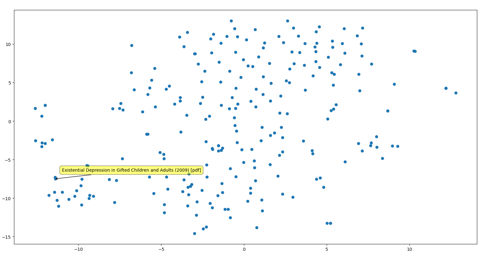

# hn-clusters

This is a simple script that takes the hn content you follow and graphs it so you can see trends. The hn_history is an example of formatting and will crash if you run it due to insufficient data for dimension reduction (should have 200+ links, or use the smaller embedding model).

#### features that would be fun but i'm not going to implement unless i have an explicit reason to
- tagging data from different devices in different colors
- tagging data from different people in different colors (potentially against an "average" if I ever host this somewhere
